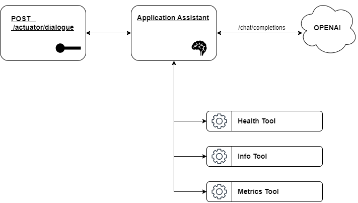

# DialogueSense - Spring Boot Application

This is a Spring Boot application that provides a management endpoint at `/actuator/dialogue`, allowing users to chat directly with the application. Unlike traditional chatbot interfaces, this application personifies itself as an AI assistant. Additionally, it has access to various tools that enable it to retrieve application health, metrics, and general information from the particular actuator results.



## Prerequisites

Before running the application, ensure you have Java 21 installed. Follow these steps to install Java 21:

### Installing Java 21

#### On Windows:
1. Download the latest Java 21 JDK from the [Oracle JDK website](https://www.oracle.com/java/technologies/javase/jdk21-archive-downloads.html) or use [Adoptium](https://adoptium.net/).
2. Install the downloaded package and set up the `JAVA_HOME` environment variable.
3. Verify installation:
   ```
   java -version
   ```

#### On Linux/macOS:
1. Use a package manager like SDKMAN! or Homebrew:
   ```
   sdk install java 21-open
   ```
   or
   ```
   brew install openjdk@21
   ```
2. Verify installation:
   ```
   java -version
   ```

## Running the Application

Before starting the application, set the OpenAI API key.

### Option 1: Using Environment Variables
Set the `AI_API_KEY` environment variable with your OpenAI API key:
```
export AI_API_KEY=your_openai_api_key
```
Then start the application with:
```
mvnw spring-boot:run
```

### Option 2: Passing API Key in the Command Line
Alternatively, you can provide the API key directly in the startup command:
```
mvnw spring-boot:run -Dspring-boot.run.arguments="--dialogue-sense.ai.api-key=YOUR_API_KEY"
```

## Accessing the Dialogue Endpoint
Once the application is running, you can interact with it using the `/actuator/dialogue` endpoint.

Example request:
```
curl -X POST http://localhost:8080/actuator/dialogue \
     -H "Content-Type: application/json" \
     -d '{"message": "Hello!"}'
```
